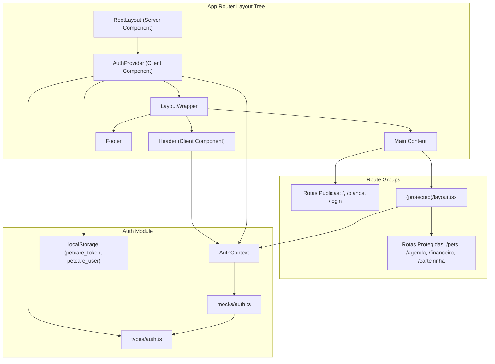
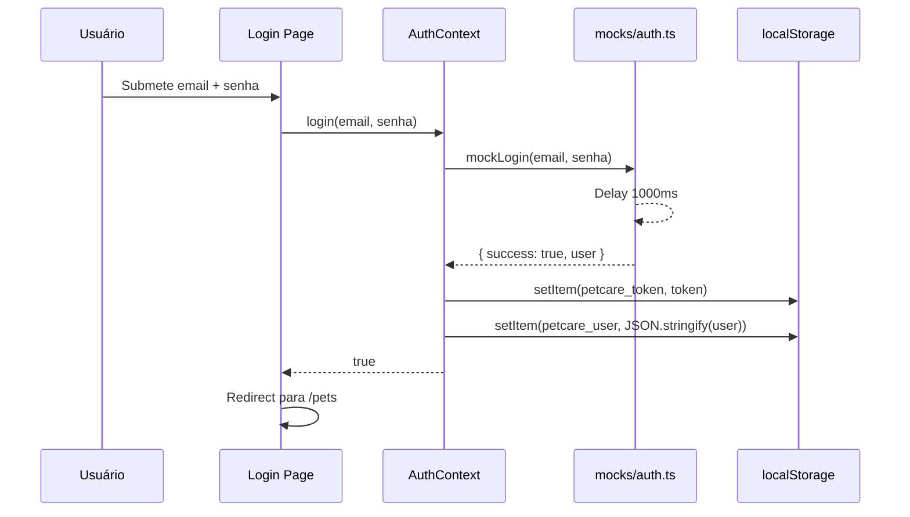
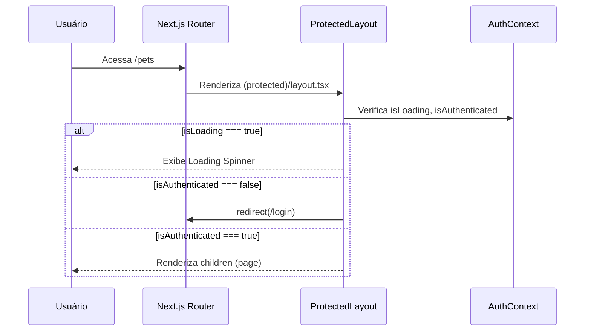

# Design Document: Auth Context & Route Protection

## Overview

Esta feature refatora o módulo de autenticação existente do Pet Care para suportar dados de usuário (nome e email), persistência de sessão via localStorage, e implementa proteção de rotas client-side. O design utiliza React Context API para gerenciamento de estado global, um componente ProtectedRoute via Route Groups do Next.js App Router, e um módulo mock centralizado para simular autenticação.

### Decisões de Design

1. **Client-side route protection**: Optou-se por proteção client-side via React Context em vez de middleware do Next.js. Isso mantém a simplicidade para um mock de autenticação e permite feedback visual imediato (loading spinner) durante a verificação de sessão.

2. **Route Groups para proteção**: Utilizar o padrão `(protected)` do App Router permite agrupar rotas protegidas sob um layout compartilhado que executa a verificação de autenticação, evitando duplicação de lógica em cada página.

3. **localStorage para persistência**: Token e dados de usuário são armazenados em localStorage para manter a sessão entre recarregamentos. O design trata graciosamente cenários onde localStorage não está disponível (SSR, modo privado).

4. **Módulo mock centralizado**: A lógica de autenticação mock fica isolada em `/mocks/auth.ts`, facilitando a futura substituição por chamadas reais de API sem alterar o AuthContext.

## Architecture



### Fluxo de Autenticação



### Fluxo de Proteção de Rota



## Components and Interfaces

### Estrutura de Arquivos

```
/types/auth.ts                          → Tipos do módulo de autenticação
/mocks/auth.ts                          → Função mockLogin
/contexts/AuthContext.tsx                → AuthProvider e useAuth hook (refatorado)
/app/(protected)/layout.tsx             → Layout com ProtectedRoute logic
/app/(protected)/pets/page.tsx          → Migrada de /app/pets/page.tsx
/app/(protected)/agenda/page.tsx        → Migrada de /app/agenda/page.tsx
/app/(protected)/financeiro/page.tsx    → Migrada de /app/financeiro/page.tsx
/app/(protected)/carteirinha/page.tsx   → Migrada de /app/carteirinha/page.tsx
/app/login/page.tsx                     → Refatorada com redirecionamento
/components/layout/Header.tsx           → Refatorado para usar logout com redirect
```

### Componente: AuthProvider (refatorado)

```typescript
// contexts/AuthContext.tsx
"use client";

export function AuthProvider({ children }: { children: ReactNode }) {
  // State: user, isAuthenticated, isLoading
  // useEffect: verifica localStorage na montagem
  // login: chama mockLogin, persiste no localStorage
  // logout: limpa localStorage, redireciona para /
}

export function useAuth(): AuthContextType { ... }
```

**Responsabilidades:**
- Gerenciar estado global de autenticação
- Hidratar estado a partir de localStorage na montagem
- Expor login/logout para componentes filhos
- Tratar erros de localStorage graciosamente

### Componente: ProtectedLayout

```typescript
// app/(protected)/layout.tsx
"use client";

export default function ProtectedLayout({ children }: { children: ReactNode }) {
  const { isAuthenticated, isLoading } = useAuth();
  const router = useRouter();

  // Se isLoading: exibe spinner acessível
  // Se !isAuthenticated: redirect para /login
  // Se isAuthenticated: renderiza children
}
```

**Responsabilidades:**
- Verificar autenticação antes de renderizar páginas protegidas
- Exibir estado de loading acessível (aria-live, role="status")
- Redirecionar visitantes não autenticados

### Componente: Login Page (refatorado)

```typescript
// app/login/page.tsx
"use client";

export default function LoginPage() {
  const { isAuthenticated, isLoading } = useAuth();
  const router = useRouter();

  // Se isLoading: exibe loading
  // Se isAuthenticated: redirect para /pets
  // Caso contrário: renderiza formulário de login
}
```

### Módulo: Mock Auth

```typescript
// mocks/auth.ts
export async function mockLogin(
  email: string, 
  senha: string
): Promise<{ success: boolean; user?: User }> {
  // Delay de 1000ms
  // Validação de email (regex: contém @ seguido de domínio com .)
  // Validação de senha (exatamente "123456")
  // Retorna { success, user? }
}
```

## Data Models

### Types (types/auth.ts)

```typescript
export interface User {
  nome: string;
  email: string;
}

export interface AuthContextType {
  user: User | null;
  isAuthenticated: boolean;
  isLoading: boolean;
  login: (email: string, senha: string) => Promise<boolean>;
  logout: () => void;
}

export interface MockLoginResponse {
  success: boolean;
  user?: User;
}
```

### localStorage Schema

| Chave | Tipo | Descrição |
|-------|------|-----------|
| `petcare_token` | `string` | Token fictício (ex: `"mock-token-{timestamp}"`) |
| `petcare_user` | `string` (JSON) | Objeto `User` serializado: `{ "nome": "...", "email": "..." }` |

### Validação de Email (Regex)

```
/^[^\s@]+@[^\s@]+\.[^\s@]{2,}$/
```

Critérios:
- Exatamente um `@`
- Pelo menos um caractere antes do `@`
- Pelo menos um caractere entre `@` e `.`
- Pelo menos 2 caracteres após o último `.`

### Estado do AuthContext

```typescript
// Estado inicial (antes da verificação)
{ user: null, isAuthenticated: false, isLoading: true }

// Após verificação - sem sessão
{ user: null, isAuthenticated: false, isLoading: false }

// Após verificação - com sessão válida
{ user: { nome: "Usuário PetCare", email: "..." }, isAuthenticated: true, isLoading: false }

// Após login bem-sucedido
{ user: { nome: "Usuário PetCare", email: "..." }, isAuthenticated: true, isLoading: false }

// Após logout
{ user: null, isAuthenticated: false, isLoading: false }
```

## Correctness Properties

*A property is a characteristic or behavior that should hold true across all valid executions of a system — essentially, a formal statement about what the system should do. Properties serve as the bridge between human-readable specifications and machine-verifiable correctness guarantees.*

### Property 1: Login and session persistence round-trip

*For any* valid email (matching the regex `^[^\s@]+@[^\s@]+\.[^\s@]{2,}$`) and the correct password "123456", calling `login(email, senha)` and then re-mounting the AuthProvider should produce the same `user` object with matching `nome` and `email`, and `isAuthenticated` should be `true`.

**Validates: Requirements 2.3, 2.4, 3.1, 3.2, 3.3**

### Property 2: Logout always clears authentication state

*For any* authenticated state (with any valid `User` object stored in context and localStorage), calling `logout()` should result in `user === null`, `isAuthenticated === false`, and both `petcare_token` and `petcare_user` removed from localStorage.

**Validates: Requirements 2.5, 4.1, 4.2**

### Property 3: Invalid credentials are always rejected

*For any* email string that does not match the pattern `^[^\s@]+@[^\s@]+\.[^\s@]{2,}$`, OR *for any* password string that is not exactly "123456", calling `mockLogin(email, senha)` should resolve with `{ success: false }` and the auth state should remain unchanged (user stays null, isAuthenticated stays false, localStorage unchanged).

**Validates: Requirements 3.5, 3.6, 8.3, 8.5**

### Property 4: Valid credentials always produce successful authentication

*For any* email string that matches the pattern `^[^\s@]+@[^\s@]+\.[^\s@]{2,}$` and the password "123456", calling `mockLogin(email, "123456")` should resolve with `{ success: true, user: { nome: "Usuário PetCare", email: <email_informado> } }`.

**Validates: Requirements 3.1, 3.4, 8.4**

### Property 5: Navigation item filtering matches authentication state

*For any* navigation configuration containing items with mixed `visibility` values ("public" and "authenticated"), and *for any* boolean authentication state, the filtered items should contain exclusively items whose `visibility` matches "authenticated" when `isAuthenticated === true`, and exclusively items whose `visibility` matches "public" when `isAuthenticated === false`.

**Validates: Requirements 7.1, 7.2**

## Error Handling

### localStorage Indisponível

| Cenário | Comportamento |
|---------|---------------|
| localStorage throws na montagem | AuthProvider inicializa com `{ user: null, isAuthenticated: false, isLoading: false }` |
| localStorage throws no login | Login retorna `false`, estado não muda |
| localStorage throws no logout | Estado é resetado in-memory, redirecionamento para `/` ocorre normalmente |

**Implementação:** Todas as operações de localStorage são envolvidas em `try/catch`. Erros são silenciados (console.warn opcional) para não quebrar a UX.

### Dados Corrompidos no localStorage

| Cenário | Comportamento |
|---------|---------------|
| `petcare_user` contém JSON inválido | AuthProvider inicializa como não autenticado |
| `petcare_user` contém JSON válido mas sem campos obrigatórios | AuthProvider inicializa como não autenticado |
| `petcare_token` existe mas `petcare_user` não | AuthProvider inicializa como não autenticado |

**Implementação:** A hidratação de sessão valida que ambas as chaves existem e que `petcare_user` é um JSON parseável com campos `nome` e `email` do tipo string.

### Redirecionamentos

| Cenário | Destino | Mecanismo |
|---------|---------|-----------|
| Rota protegida sem autenticação | `/login` | `router.push` no ProtectedLayout |
| Página de login com autenticação | `/pets` | `router.push` na LoginPage |
| Logout bem-sucedido | `/` | `router.push` no AuthContext |

## Testing Strategy

### Abordagem Dual de Testes

A estratégia combina testes unitários (example-based) para cenários específicos e testes baseados em propriedades (property-based) para garantias universais.

### Testes Baseados em Propriedades (Property-Based Tests)

**Biblioteca:** `fast-check` com `vitest`

**Configuração:**
- Mínimo de 100 iterações por propriedade
- Cada teste referencia a propriedade do design document
- Tag format: `Feature: auth-context-route-protection, Property {N}: {description}`

**Propriedades a implementar:**

1. **Round-trip de sessão** — Gerar emails válidos aleatórios, executar login, remontar provider, verificar que o estado é restaurado
2. **Logout limpa estado** — Gerar estados autenticados aleatórios, executar logout, verificar limpeza completa
3. **Credenciais inválidas rejeitadas** — Gerar strings aleatórias que não passam na validação, verificar rejeição consistente
4. **Credenciais válidas aceitas** — Gerar emails válidos aleatórios com senha correta, verificar sucesso consistente
5. **Filtragem de navegação** — Gerar configs de navegação aleatórias, verificar que filtragem respeita estado de auth

### Testes Unitários (Example-Based)

**Cenários cobertos:**

- AuthProvider expõe todas as propriedades corretas no contexto
- Ciclo de vida: mount → isLoading → check → isLoading false
- Loading spinner com atributos de acessibilidade (aria-live, role)
- Redirecionamento de ProtectedLayout para /login quando não autenticado
- Redirecionamento de LoginPage para /pets quando autenticado
- Botão Logout no Header invoca função logout
- localStorage indisponível não quebra a aplicação
- JSON corrompido no localStorage é tratado graciosamente
- Logout redireciona para / via router.push
- Delay de 1000ms no mockLogin

### Testes de Integração

- Fluxo completo: login → navegação em rota protegida → logout → redirecionamento
- Persistência entre "recarregamentos" (remount do provider)
- Header atualiza itens de navegação ao mudar estado de auth

### Ferramentas

| Ferramenta | Uso |
|------------|-----|
| vitest | Test runner |
| @testing-library/react | Renderização e interação com componentes |
| fast-check | Property-based testing |
| jsdom | Ambiente DOM para testes |

