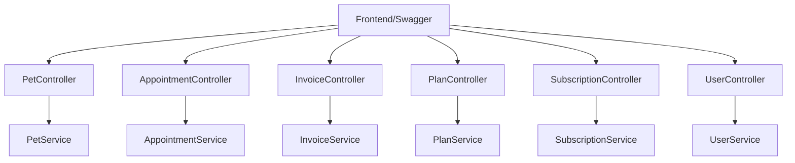

# Design Document: Controllers — Endpoints REST

## Overview

Camada de controllers REST seguindo padrão thin controller: recebe request, valida, delega para service, retorna ResponseEntity com status code correto. Swagger annotations em todos os métodos para documentação automática.

### Decisões de Design

- **@CurrentUser annotation + ArgumentResolver**: Mais limpo que injetar Authentication e extrair manualmente em cada método
- **ResponseEntity explícito**: Controle total dos status codes (201 Created, 204 No Content) em vez de depender de defaults
- **Pageable via query params**: Spring Data resolve automaticamente page, size, sort dos query parameters
- **Controllers sem lógica**: Apenas delegação — toda lógica fica no service

## Architecture



## File Structure

```
backend/src/main/java/com/petcare/api/
├── controller/
│   ├── PetController.java
│   ├── AppointmentController.java
│   ├── InvoiceController.java
│   ├── PlanController.java
│   ├── SubscriptionController.java
│   ├── UserController.java
│   └── HealthController.java
├── security/
│   ├── CurrentUser.java
│   └── CurrentUserArgumentResolver.java
└── config/
    └── WebConfig.java
```
