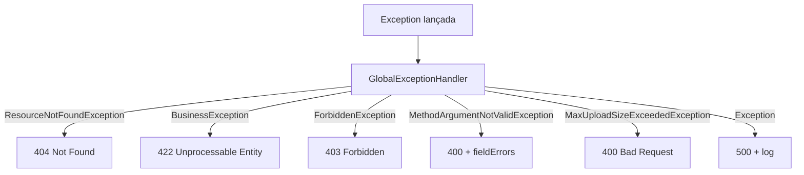

# Design Document: Exception Handling Global

## Overview

GlobalExceptionHandler centraliza tratamento de todas as exceções da aplicação. Usa @ExceptionHandler com especificidade crescente (exceções mais específicas primeiro) e HttpServletRequest para capturar o path da requisição.

### Decisões de Design

- **HttpServletRequest para path**: Mais simples que WebRequest para apenas extrair URI
- **Log apenas em 500**: Erros de negócio (422, 404, 403) não poluem logs — só erros inesperados
- **@JsonInclude.NON_NULL no ErrorResponse**: fieldErrors só aparece quando relevante (validação)
- **Mensagem genérica em 500**: Nunca expor detalhes internos — "Erro interno do servidor" para o client

## Architecture



## File Structure

```
backend/src/main/java/com/petcare/api/exception/
├── GlobalExceptionHandler.java
├── BusinessException.java
├── ResourceNotFoundException.java
└── ForbiddenException.java
```
