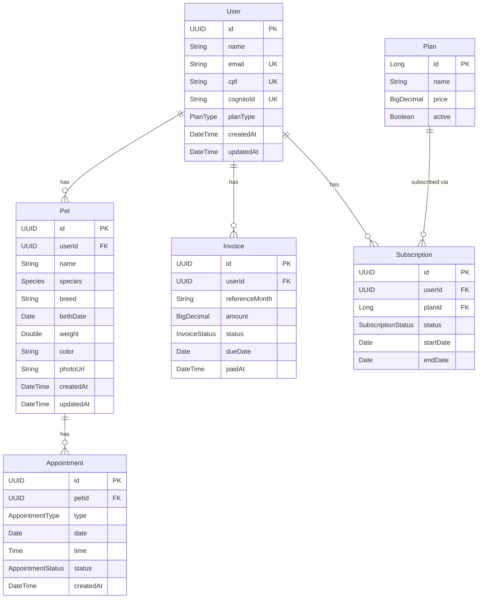

# Design Document: Entidades JPA e Modelagem do Banco

## Overview

Este design define o modelo de domínio do Pet Care como entidades JPA/Hibernate mapeadas para PostgreSQL. A modelagem segue DDD simplificado com entidades ricas em relacionamentos, usando UUID como identificadores de domínio (exceto Plan que usa Long auto-increment por ser tabela de referência).

### Decisões de Design

- **UUID para IDs de domínio**: Evita exposição de sequenciais, facilita merge de dados entre ambientes e é gerado pela aplicação
- **Long para Plan**: Tabela de referência com poucos registros, simplifica data.sql e queries
- **@ElementCollection para features**: Evita criar entidade separada para algo simples (lista de strings)
- **Lazy loading em @ManyToOne**: Evita N+1 queries por padrão
- **Lombok**: Reduz boilerplate sem sacrificar funcionalidade (getters, setters, builders, constructors)
- **Auditing via Hibernate annotations**: @CreationTimestamp e @UpdateTimestamp são simples e não requerem config extra de JPA Auditing

## Architecture



## File Structure

```
backend/src/main/java/com/petcare/api/model/
├── entity/
│   ├── User.java
│   ├── Pet.java
│   ├── Plan.java
│   ├── Subscription.java
│   ├── Appointment.java
│   └── Invoice.java
└── enums/
    ├── Species.java
    ├── PlanType.java
    ├── SubscriptionStatus.java
    ├── AppointmentType.java
    ├── AppointmentStatus.java
    └── InvoiceStatus.java
```
