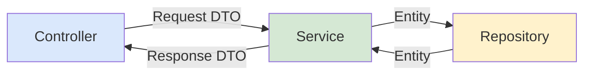

# Design Document: Repositories e DTOs

## Overview

Camada de acesso a dados via Spring Data JPA repositories com query methods derivados e @Query customizadas. DTOs implementados como Java records para imutabilidade e concisão, com métodos factory estáticos `from()` para conversão entity→DTO.

### Decisões de Design

- **Java Records para DTOs**: Imutáveis por natureza, menos boilerplate que classes + Lombok, suportam validação Jakarta
- **Método `from(Entity)` estático nos Response DTOs**: Padrão de conversão colocado no DTO (não em mappers separados), mantém simplicidade sem adicionar dependência de MapStruct
- **PageResponse genérico**: Evita repetir estrutura de paginação em cada endpoint, aceita function de mapeamento
- **CPF mascarado no UserResponse**: Nunca expor CPF completo na API — mascarar no momento da conversão
- **@Query para findByPetIdIn**: Query derivada não suporta `IN` com lista facilmente em paginação

## Architecture



## File Structure

```
backend/src/main/java/com/petcare/api/
├── repository/
│   ├── UserRepository.java
│   ├── PetRepository.java
│   ├── PlanRepository.java
│   ├── SubscriptionRepository.java
│   ├── AppointmentRepository.java
│   └── InvoiceRepository.java
└── model/dto/
    ├── PetRequest.java
    ├── PetResponse.java
    ├── AppointmentRequest.java
    ├── AppointmentResponse.java
    ├── InvoiceResponse.java
    ├── PlanResponse.java
    ├── UserResponse.java
    ├── UserUpdateRequest.java
    ├── SubscriptionRequest.java
    ├── SlotResponse.java
    ├── PageResponse.java
    ├── ErrorResponse.java
    ├── AuthRequest.java
    ├── AuthResponse.java
    ├── RegisterRequest.java
    └── RefreshRequest.java
```
