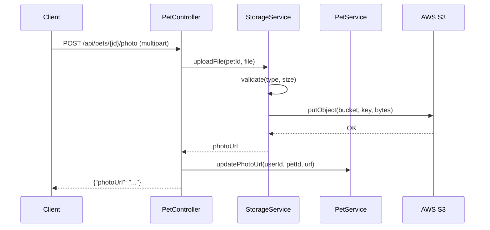

# Design Document: Upload de Fotos — Integração S3

## Overview

Upload de fotos de pets via endpoint multipart com armazenamento no S3. Validação de tipo/tamanho no service, não no controller, para centralizar regras.

### Decisões de Design

- **Validação no StorageService**: Controller apenas delega — validações de tipo/tamanho ficam centralizadas no service
- **Path com UUID**: `pets/{petId}/{uuid}.ext` evita colisões e facilita cleanup por pet
- **getUrl() ao invés de presigned**: Para fotos públicas de perfil, URL pública é mais simples que presigned URLs com expiração
- **deleteFile silencioso**: Falha no delete não deve bloquear outras operações (eventual consistency)
- **LocalStack com init script**: Cria bucket automaticamente ao subir containers

## Architecture



## File Structure

```
backend/src/main/java/com/petcare/api/service/StorageService.java
scripts/init-localstack.sh
docker-compose.yml (volume mount)
backend/src/main/resources/application.yml (multipart config)
backend/src/main/resources/application-local.yml (aws.s3.bucket)
```
