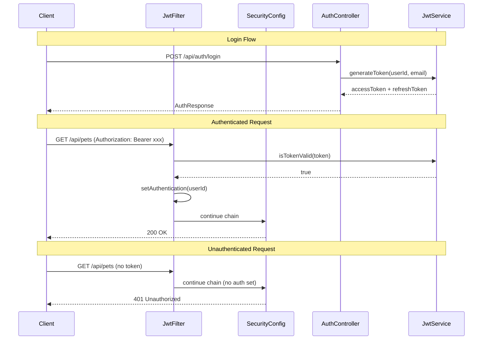

# Design Document: Spring Security + JWT Cognito

## Overview

Segurança stateless via JWT com filter chain customizada. Profile local usa HMAC secret fixo para facilitar desenvolvimento; produção integraria com AWS Cognito JWKS.

### Decisões de Design

- **HMAC ao invés de RSA em local**: Mais simples para dev, sem necessidade de key pair management
- **jjwt 0.12.6**: Biblioteca madura, API fluent, suporte a Java 17+
- **Filter não bloqueia requests sem token**: SecurityConfig é quem decide quais paths exigem auth — filter apenas popula context se token presente
- **AuthService com senha mock "123456"**: Suficiente para dev/demo — produção delegaria para Cognito
- **Refresh token com 7x a vida do access**: Padrão comum, permite renovação sem re-login frequente

## Architecture



## File Structure

```
backend/src/main/java/com/petcare/api/
├── security/
│   ├── JwtService.java
│   ├── JwtAuthenticationFilter.java
│   ├── SecurityConfig.java
│   ├── CurrentUser.java
│   └── CurrentUserArgumentResolver.java
├── service/
│   └── AuthService.java
├── controller/
│   └── AuthController.java
└── model/dto/
    ├── AuthRequest.java
    ├── AuthResponse.java
    ├── RegisterRequest.java
    └── RefreshRequest.java
```
