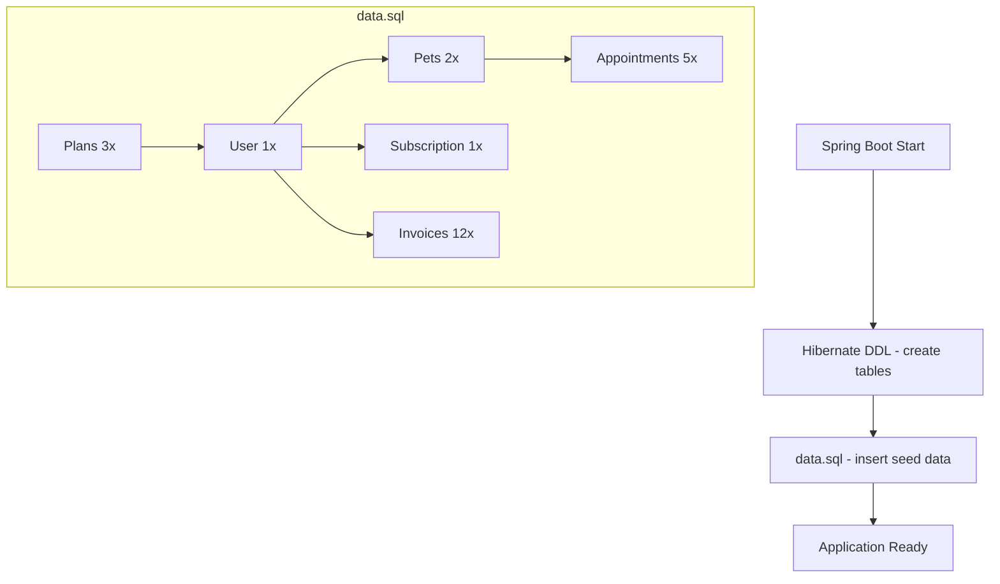

# Design Document: Dados Iniciais para Desenvolvimento

## Overview

Arquivo data.sql com INSERT statements para popular o banco no profile local. Usa UUIDs fixos para facilitar referência cruzada entre tabelas e testes manuais via Swagger.

### Decisões de Design

- **UUIDs fixos**: Permite referenciar IDs em inserts relacionados e facilita testes via Swagger/Postman
- **Datas relativas (CURRENT_DATE +/- N)**: Agendamentos sempre ficam "frescos" independente de quando o dev subiu a aplicação
- **ddl-auto: create**: Recria tabelas toda vez que sobe — aceita data.sql sem conflitos de dados existentes
- **defer-datasource-initialization: true**: Garante que Hibernate cria tabelas ANTES do data.sql rodar
- **spring.sql.init.mode: never no test**: Evita que o data.sql interfira nos testes unitários que usam H2

## Architecture



## File Structure

```
backend/src/main/resources/
├── data.sql                     (seed data - only loaded in profile local)
├── application-local.yml        (ddl-auto: create, sql.init.mode: always)
└── application-test.yml         (sql.init.mode: never)
```
