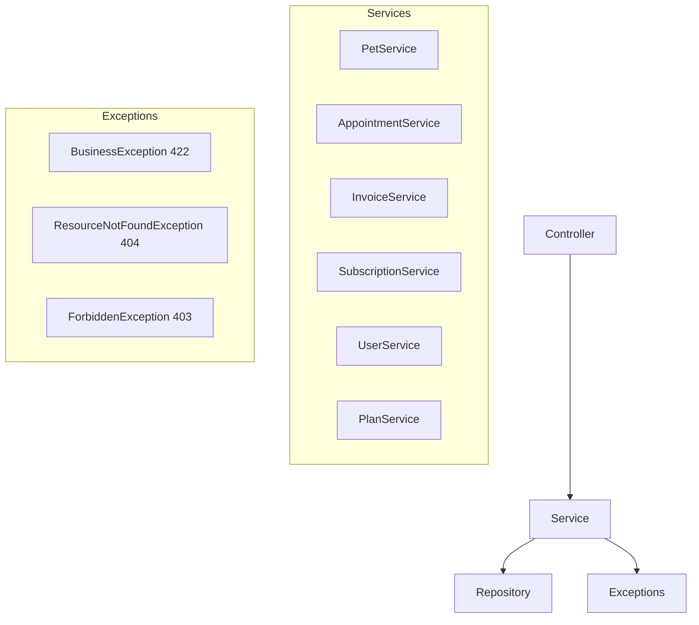

# Design Document: Services — Regras de Negócio

## Overview

Camada de serviço seguindo padrão @Service + @RequiredArgsConstructor com injeção via construtor. Cada service encapsula operações de uma entidade/domínio e recebe userId como parâmetro (nunca do request body). Transações gerenciadas via @Transactional.

### Decisões de Design

- **userId como parâmetro do method**: Desacoplamento do SecurityContext — facilita testes unitários com Mockito
- **Exceções não-checked (RuntimeException)**: Evitam try/catch verboso nos controllers, capturadas pelo GlobalExceptionHandler
- **@Transactional apenas em escritas**: Reads são non-transactional por padrão (melhora performance)
- **Constantes para validação**: MAX_PETS_PER_USER e VALID_SLOTS declarados no service para fácil manutenção
- **Ownership check centralizado no PetService**: Método `getPetWithOwnershipCheck` reutilizado por update/delete/photo

## Architecture



## File Structure

```
backend/src/main/java/com/petcare/api/
├── service/
│   ├── PetService.java
│   ├── AppointmentService.java
│   ├── InvoiceService.java
│   ├── SubscriptionService.java
│   ├── UserService.java
│   ├── PlanService.java
│   ├── AuthService.java
│   └── StorageService.java
└── exception/
    ├── BusinessException.java
    ├── ResourceNotFoundException.java
    └── ForbiddenException.java
```
