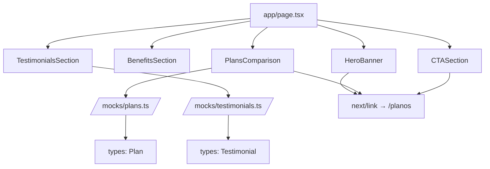

# Design Document: Home Page Marketing

## Overview

A Home Page Marketing é a página principal do portal Pet Care, responsável por comunicar a proposta de valor do serviço de planos de saúde para pets e converter visitantes em assinantes. A página é composta por 5 seções sequenciais (Hero Banner, Benefits, Plans Comparison, Testimonials, Final CTA), todas renderizadas como Server Component no Next.js 14 App Router.

A implementação segue abordagem mobile-first com Tailwind CSS, utiliza dados mockados importados de `/mocks/plans.ts` e `/mocks/testimonials.ts`, e navega internamente via `next/link` para a rota `/planos`.

### Decisões de Design

- **Server Component**: A página não requer interatividade client-side (sem formulários, modals ou estado), portanto será um Server Component puro, otimizando performance e SEO.
- **Dados Mock locais**: Planos e depoimentos são importados diretamente de arquivos TypeScript com tipos co-localizados, seguindo o padrão estabelecido em `/mocks/auth.ts` e `/mocks/navigation.ts`.
- **Navegação com next/link**: Todos os CTAs usam `next/link` para navegação SPA sem reload, seguindo o padrão do Header existente.
- **Componentes inline**: As seções são implementadas como componentes extraídos dentro de `/components/home/` para manter organização, mas sem over-engineering.

## Architecture



### Fluxo de Dados

1. `app/page.tsx` importa os componentes de seção e os dados mock
2. Os dados de planos e depoimentos fluem como props para os componentes correspondentes
3. Todos os links de CTA apontam para `/planos` usando `next/link`
4. O layout existente (`app/layout.tsx`) já provê Header, Footer e AuthProvider

### Estrutura de Arquivos

```
app/
  page.tsx                    ← Página principal (Server Component)
components/
  home/
    HeroBanner.tsx           ← Seção hero com título e CTA
    BenefitsSection.tsx      ← Grid de benefícios (4 cards)
    PlansComparison.tsx      ← Comparativo de planos (3 cards)
    TestimonialsSection.tsx  ← Depoimentos (3 cards)
    CTASection.tsx           ← CTA final
mocks/
  plans.ts                   ← Dados e tipo dos planos
  testimonials.ts            ← Dados e tipo dos depoimentos
```

## Components and Interfaces

### HeroBanner

Seção de destaque no topo com título h1, subtítulo e botão CTA.

```typescript
// components/home/HeroBanner.tsx (Server Component)
export default function HeroBanner() {
  // Renderiza:
  // - <section> com bg-primary-50, py-16 md:py-24, full width
  // - <h1> "Cuidado completo para quem você ama"
  // - <p> "Planos a partir de R$ 49,90/mês"
  // - <Link href="/planos"> com texto "Conheça nossos planos"
  // Tudo center-aligned
}
```

### BenefitsSection

Grid de 4 cards com ícone, título e descrição.

```typescript
// components/home/BenefitsSection.tsx (Server Component)
interface BenefitItem {
  icon: string;
  title: string;
  description: string;
}

export default function BenefitsSection() {
  // Dados inline (fixos, 4 items)
  // Grid: 1col mobile → 2col md → 4col lg
  // Section heading <h2>
}
```

### PlansComparison

Comparativo de planos consumindo dados do mock.

```typescript
// components/home/PlansComparison.tsx (Server Component)
import { plans, Plan } from "@/mocks/plans";

interface PlanCardProps {
  plan: Plan;
}

function PlanCard({ plan }: PlanCardProps) {
  // Card individual com name, price, features, CTA button
  // Se plan.highlighted → borda primary-500 + badge "Mais popular"
}

export default function PlansComparison() {
  // Mapeia plans[] → PlanCard
  // Grid: 1col mobile → 3col md
  // Section heading <h2>
}
```

### TestimonialsSection

Cards de depoimento consumindo dados do mock.

```typescript
// components/home/TestimonialsSection.tsx (Server Component)
import { testimonials, Testimonial } from "@/mocks/testimonials";

interface TestimonialCardProps {
  testimonial: Testimonial;
}

function TestimonialCard({ testimonial }: TestimonialCardProps) {
  // Avatar circular 64x64 com fallback
  // Nome do cliente
  // Texto do depoimento
}

export default function TestimonialsSection() {
  // Mapeia testimonials[] → TestimonialCard
  // Grid: 1col mobile → 3col md
  // Section heading <h2>
}
```

### CTASection

Seção final de conversão.

```typescript
// components/home/CTASection.tsx (Server Component)
export default function CTASection() {
  // <section> com bg-primary-500, text-white, center-aligned
  // <h2> "Seu pet merece o melhor"
  // <p> subtítulo
  // <Link href="/planos"> "Contratar agora" (botão branco/outline)
}
```

## Data Models

### Plan

```typescript
// mocks/plans.ts
export interface Plan {
  id: string;
  name: string;         // max 50 chars
  price: number;        // valor numérico (e.g. 49.90)
  priceLabel: string;   // formatado (e.g. "R$ 49,90/mês")
  features: string[];   // 1-10 items
  highlighted: boolean; // exatamente 1 plan com true
}

export const plans: Plan[] = [
  {
    id: "basico",
    name: "Básico",
    price: 49.90,
    priceLabel: "R$ 49,90/mês",
    features: ["Consultas", "Vacinas"],
    highlighted: false,
  },
  {
    id: "plus",
    name: "Plus",
    price: 89.90,
    priceLabel: "R$ 89,90/mês",
    features: ["Consultas", "Vacinas", "Exames", "Emergência"],
    highlighted: true,
  },
  {
    id: "premium",
    name: "Premium",
    price: 149.90,
    priceLabel: "R$ 149,90/mês",
    features: ["Consultas", "Vacinas", "Exames", "Emergência", "Cirurgias", "Internação"],
    highlighted: false,
  },
];
```

### Testimonial

```typescript
// mocks/testimonials.ts
export interface Testimonial {
  id: string;
  name: string;       // max 80 chars
  avatar: string;     // caminho da imagem placeholder
  text: string;       // max 300 chars
}

export const testimonials: Testimonial[] = [
  {
    id: "1",
    name: "Maria Silva",
    avatar: "/avatars/maria.png",
    text: "O Pet Care salvou a vida do meu cachorro! Atendimento rápido e veterinários muito competentes.",
  },
  {
    id: "2",
    name: "João Santos",
    avatar: "/avatars/joao.png",
    text: "Melhor investimento que fiz pro meu gato. As consultas ilimitadas fazem toda a diferença.",
  },
  {
    id: "3",
    name: "Ana Oliveira",
    avatar: "/avatars/ana.png",
    text: "Recomendo para todos os donos de pets! O app de acompanhamento é muito prático.",
  },
];
```

### BenefitItem (inline, não exportado como mock)

```typescript
interface BenefitItem {
  icon: string;
  title: string;
  description: string;
}

const benefits: BenefitItem[] = [
  { icon: "🏥", title: "Consultas ilimitadas", description: "Sem limite de consultas para seu pet" },
  { icon: "🌐", title: "Rede credenciada", description: "Mais de 500 clínicas parceiras" },
  { icon: "🚨", title: "Emergência 24h", description: "Atendimento de urgência a qualquer hora" },
  { icon: "📱", title: "App de acompanhamento", description: "Acompanhe tudo pelo portal" },
];
```


## Correctness Properties

*A property is a characteristic or behavior that should hold true across all valid executions of a system — essentially, a formal statement about what the system should do. Properties serve as the bridge between human-readable specifications and machine-verifiable correctness guarantees.*

### Property 1: Plan card rendering completeness

*For any* plan object with valid name, price, features list, and highlighted flag, rendering a PlanCard should produce output containing the plan name, price label, all listed features each preceded by a check indicator, and a CTA link element with href="/planos".

**Validates: Requirements 3.6, 3.7**

### Property 2: Testimonial card character constraints

*For any* testimonial object with name up to 80 characters and text up to 300 characters, the rendered TestimonialCard should display the name truncated to at most 50 visible characters and the text truncated to at most 200 visible characters, with a circular avatar area of 64x64 pixels.

**Validates: Requirements 4.2**

### Property 3: Heading hierarchy correctness

*For any* rendered state of the Home Page, the heading elements should follow strict hierarchical order: exactly one h1, followed by h2 elements for sections, with no skipped levels (no h3 without a preceding h2, no h2 without a preceding h1).

**Validates: Requirements 7.2**

### Property 4: Accessibility attributes on interactive and informative elements

*For any* interactive element (link or button) rendered on the Home Page, it should be a semantic `<a>` or `<button>` element with either visible text content or an aria-label attribute of at least 3 characters. *For any* informative image rendered, it should have an alt attribute with text between 5 and 125 characters.

**Validates: Requirements 7.3, 7.5**

### Property 5: Plans mock data structure invariants

*For any* plan object in the exported plans array, the name should be a string of at most 50 characters, the price should be a positive number, and the features array should contain between 1 and 10 string items. Across the entire array, exactly one plan should have highlighted set to true.

**Validates: Requirements 8.3**

### Property 6: Testimonials mock data structure invariants

*For any* testimonial object in the exported testimonials array, the name should be a string of at most 80 characters, the avatar should be a non-empty string representing an image path, and the text should be a string of at most 300 characters.

**Validates: Requirements 8.4**

## Error Handling

### Image Loading Failures

- **Avatar fallback**: Quando a imagem de avatar de um depoimento falha ao carregar, o `` deve utilizar o evento `onError` para substituir o `src` por um placeholder inline (SVG ou div com iniciais), mantendo as dimensões 64x64px circulares. Alternativa: usar `next/image` com propriedade `placeholder="blur"` e blurDataURL.
- **Implementação escolhida**: Usar um elemento `<div>` com as iniciais do nome como fallback via CSS, exibido condicionalmente quando a imagem falha. Isso evita erros de imagem quebrada e mantém a experiência visual consistente.

### Dados Mock Inválidos

- Os tipos TypeScript garantem que os dados mock estejam corretamente tipados em tempo de compilação.
- Caso futuramente os dados venham de uma API, adicionar validação Zod no ponto de consumo.

### Overflow de Texto

- Texto longo que excede o container utiliza `overflow-wrap: break-word` (classe Tailwind `break-words`) para evitar scroll horizontal.
- Nomes e textos de depoimentos são truncados visualmente com `line-clamp` ou `truncate` quando excedem os limites visuais.

## Testing Strategy

### Abordagem Dual

A estratégia de testes combina testes de exemplo (unit tests) para verificações pontuais e testes de propriedade (property-based tests) para validação de invariantes universais.

### Unit Tests (Vitest + Testing Library)

Testes de exemplo cobrindo:

- **Renderização de conteúdo estático**: Verificar textos do Hero Banner, Benefits, CTA Section
- **Estrutura DOM**: Verificar ordem das seções, quantidade de cards, hierarquia de headings
- **Navegação**: Verificar que CTAs usam next/link com href="/planos"
- **Responsividade**: Verificar classes Tailwind corretas para breakpoints
- **Acessibilidade**: Verificar focus indicators, alt text, semantic elements
- **Avatar fallback**: Simular falha de imagem e verificar placeholder

### Property-Based Tests (Vitest + fast-check)

Biblioteca: **fast-check** (já instalada no projeto)

Configuração: mínimo 100 iterações por teste de propriedade.

Tag format: **Feature: home-page-marketing, Property {number}: {property_text}**

Testes de propriedade cobrindo:

1. **Property 1**: Gerar planos aleatórios válidos → renderizar PlanCard → verificar presença de todos os campos obrigatórios e link para /planos
2. **Property 2**: Gerar testimonials com nomes e textos de comprimentos variados → renderizar TestimonialCard → verificar truncamento correto
3. **Property 3**: Renderizar a página completa → extrair headings → verificar hierarquia sequencial sem pulos
4. **Property 4**: Renderizar a página → coletar todos elementos interativos → verificar semântica e labels; coletar imagens → verificar alt text
5. **Property 5**: Gerar arrays de planos aleatórios → validar contra as constraints (name ≤50, price > 0, features 1-10, exactly one highlighted)
6. **Property 6**: Gerar arrays de testimonials aleatórios → validar contra as constraints (name ≤80, avatar non-empty, text ≤300)

### Estrutura de Testes

```
__tests__/
  components/
    HeroBanner.test.tsx          ← Unit tests para Hero Banner
    BenefitsSection.test.tsx     ← Unit tests para Benefits
    PlansComparison.test.tsx     ← Unit + Property tests para Plans
    TestimonialsSection.test.tsx ← Unit + Property tests para Testimonials
    CTASection.test.tsx          ← Unit tests para CTA
  app/
    HomePage.test.tsx            ← Integration test da página completa
    HomePage.property.test.tsx   ← Property tests (heading hierarchy, accessibility)
  mocks/
    plans.property.test.ts       ← Property tests para estrutura de dados plans
    testimonials.property.test.ts ← Property tests para estrutura de dados testimonials
```

### Ferramentas

- **Vitest**: Test runner (já configurado)
- **@testing-library/react**: Renderização e queries DOM
- **fast-check**: Geração de dados aleatórios para property tests
- **jsdom**: Ambiente de DOM simulado (já configurado no vitest.config.ts)
