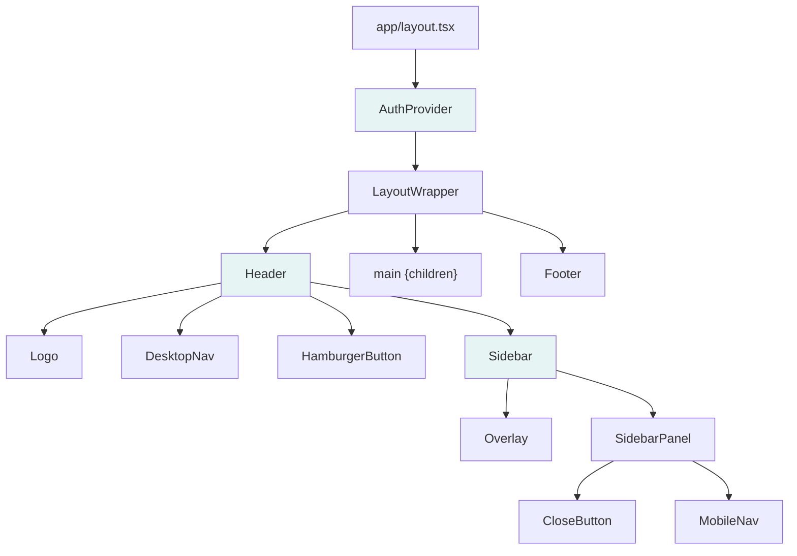
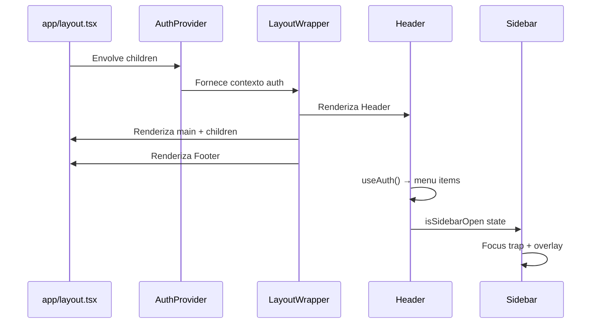

# Design Document: Layout Base

## Overview

Este design define a arquitetura dos componentes estruturais do portal Pet Care: Header, Footer, Sidebar (mobile) e LayoutWrapper. Esses componentes fornecem navegação consistente, responsiva e acessível em todas as páginas da aplicação.

A solução utiliza Next.js 14 App Router com Server Components por padrão, marcando com `"use client"` apenas os componentes que requerem interatividade (Header com toggle de sidebar, Sidebar com focus trap). O estado de autenticação é gerenciado via Context API do React, permitindo que a navegação se adapte dinamicamente.

### Decisões de Design

- **Context API para autenticação**: Simples e suficiente para um mock de estado auth sem backend real. Evita dependências externas.
- **Componentes Client apenas onde necessário**: Header e Sidebar precisam de interatividade (useState, usePathname). Footer e LayoutWrapper podem ser Server Components.
- **Focus Trap manual**: Implementação leve sem dependência externa, usando event listeners no keydown para Tab e Escape.
- **Navegação declarativa via config**: Array tipado de `NavItem` centraliza a definição de rotas, evitando duplicação entre Header e Sidebar.

## Architecture



### Fluxo de Renderização



### Estrutura de Arquivos

```
/app
  layout.tsx              → RootLayout com AuthProvider + LayoutWrapper
  page.tsx                → Home (existente)
  /login/page.tsx         → Placeholder
  /planos/page.tsx        → Placeholder
  /pets/page.tsx          → Placeholder
  /agenda/page.tsx        → Placeholder
  /financeiro/page.tsx    → Placeholder
  /carteirinha/page.tsx   → Placeholder

/components
  /layout
    LayoutWrapper.tsx     → Wrapper com Header + main + Footer
    Header.tsx            → Header com navegação condicional ("use client")
    Footer.tsx            → Footer com informações de contato
    Sidebar.tsx           → Sidebar mobile com focus trap ("use client")

/contexts
  AuthContext.tsx         → Context + Provider para estado de autenticação

/types
  navigation.ts          → NavItem, NavigationConfig types

/mocks
  navigation.ts          → Arrays de NavItem para public e authenticated menus
```

## Components and Interfaces

### AuthContext

```typescript
// contexts/AuthContext.tsx
"use client";

interface AuthContextType {
  isAuthenticated: boolean;
  login: () => void;
  logout: () => void;
}

// Provider que envolve toda a aplicação
// Fornece estado mock de autenticação (sem backend real)
```

### LayoutWrapper

```typescript
// components/layout/LayoutWrapper.tsx
interface LayoutWrapperProps {
  children: React.ReactNode;
}

// Server Component (sem "use client")
// Renderiza: Header → <main flex-grow> → Footer
// Container flex vertical com min-h-screen
```

### Header

```typescript
// components/layout/Header.tsx
"use client";

// Usa useAuth() para determinar menu items
// Usa usePathname() para highlight de rota ativa
// Gerencia estado isSidebarOpen
// Renderiza: Logo | DesktopNav (md+) | HamburgerButton (<md) | Sidebar
```

### Sidebar

```typescript
// components/layout/Sidebar.tsx
"use client";

interface SidebarProps {
  isOpen: boolean;
  onClose: () => void;
  navItems: NavItem[];
  currentPath: string;
}

// Renderiza overlay + painel lateral
// Implementa focus trap quando aberta
// Fecha via: overlay click, botão X, tecla Escape, click em link
// aria-hidden="true" quando fechada
```

### Footer

```typescript
// components/layout/Footer.tsx

// Server Component (sem interatividade)
// Renderiza: telefone, email, links institucionais, copyright
// Layout responsivo: coluna (<md) → colunas múltiplas (md+)
```

## Data Models

### Tipos de Navegação

```typescript
// types/navigation.ts

export type NavItem = {
  label: string;
  href: string;
  visibility: "public" | "authenticated";
  type: "link" | "button";
};

export type NavigationConfig = NavItem[];
```

### Configuração de Navegação

```typescript
// mocks/navigation.ts

export const navigationItems: NavigationConfig = [
  { label: "Home", href: "/", visibility: "public", type: "link" },
  { label: "Planos", href: "/planos", visibility: "public", type: "link" },
  { label: "Login", href: "/login", visibility: "public", type: "link" },
  { label: "Meus Pets", href: "/pets", visibility: "authenticated", type: "link" },
  { label: "Agenda", href: "/agenda", visibility: "authenticated", type: "link" },
  { label: "Financeiro", href: "/financeiro", visibility: "authenticated", type: "link" },
  { label: "Carteirinha", href: "/carteirinha", visibility: "authenticated", type: "link" },
  { label: "Logout", href: "#", visibility: "authenticated", type: "button" },
];
```

### AuthContext State

```typescript
interface AuthState {
  isAuthenticated: boolean;
}
```

## Correctness Properties

*A property is a characteristic or behavior that should hold true across all valid executions of a system — essentially, a formal statement about what the system should do. Properties serve as the bridge between human-readable specifications and machine-verifiable correctness guarantees.*

### Property 1: Navigation filtering by authentication state

*For any* NavigationConfig array and *for any* authentication state (authenticated or not), the navigation menu SHALL display only items whose `visibility` field matches the current auth state ("public" when not authenticated, "authenticated" when authenticated), preserving their original order and excluding all items of the opposite visibility.

**Validates: Requirements 2.1, 2.2**

### Property 2: Active route styling is mutually exclusive and correct

*For any* current pathname and *for any* set of NavItems rendered in the menu, exactly the items whose `href` matches the current pathname SHALL receive the active style (`text-primary-500 font-semibold`), and all other items SHALL receive the inactive style (`text-gray-700`). No item can have both styles simultaneously.

**Validates: Requirements 2.4, 2.5**

### Property 3: Focus trap containment

*For any* sequence of Tab key presses while the Sidebar is open, keyboard focus SHALL remain within the sidebar panel's focusable elements, cycling from the last focusable element back to the first (and vice versa with Shift+Tab), never escaping to elements outside the sidebar.

**Validates: Requirements 3.8**

### Property 4: LayoutWrapper children pass-through

*For any* valid React children passed to LayoutWrapper, the rendered output SHALL contain those children unmodified within the `<main>` element, between the Header and Footer components.

**Validates: Requirements 5.5**

## Error Handling

### Estado de Autenticação

| Cenário | Comportamento |
|---------|---------------|
| AuthContext não disponível (Provider ausente) | Componentes assumem estado não autenticado como fallback seguro |
| Logout falha (futuro backend) | Estado local reverte para autenticado, exibe feedback visual |

### Sidebar

| Cenário | Comportamento |
|---------|---------------|
| Cliques rápidos no Hamburger | Estado controlado por debounce implícito do React (setState batching). Apenas o estado final é aplicado |
| Resize durante animação | Sidebar fecha imediatamente via useEffect com mediaQuery listener, sem aguardar animação |
| Focus trap com zero elementos focáveis | Focus trap é no-op se não encontrar elementos focáveis (cenário improvável mas seguro) |

### Navegação

| Cenário | Comportamento |
|---------|---------------|
| Rota não encontrada em NavItems | Nenhum item recebe estilo ativo (todos ficam com estilo inativo) |
| NavItem com href inválido | Next.js Link renderiza normalmente; página 404 padrão é exibida ao navegar |

### Renderização

| Cenário | Comportamento |
|---------|---------------|
| children é null/undefined | LayoutWrapper renderiza Header + main vazio + Footer sem erro |
| Conteúdo menor que viewport | Footer permanece no bottom via flex-grow no main |

## Testing Strategy

### Abordagem

O layout-base combina UI estática (Footer, Logo) com lógica condicional (filtragem de nav, active route, focus trap). A estratégia de teste reflete isso:

- **Property-based tests**: Para a lógica pura de filtragem e detecção de rota ativa (Properties 1-2)
- **Unit tests (example-based)**: Para renderização de componentes, interações de sidebar, acessibilidade
- **Smoke tests**: Para existência de rotas placeholder e compilação de tipos

### Property-Based Tests

**Library**: `fast-check` com `vitest`

**Configuração**: Mínimo 100 iterações por property test.

**Tag format**: `Feature: layout-base, Property {number}: {property_text}`

| Property | O que é gerado | O que é verificado |
|----------|---------------|-------------------|
| 1: Navigation filtering | Arrays aleatórios de NavItem com visibility mista + boolean auth state | Apenas items com visibility correta aparecem, na ordem original |
| 2: Active route styling | Pathnames aleatórios + arrays de NavItem com hrefs aleatórios | Exatamente os items com href === pathname recebem estilo ativo |
| 3: Focus trap | Sequências aleatórias de Tab/Shift+Tab keypresses | Focus nunca escapa do container |
| 4: Children pass-through | Conteúdo React aleatório (strings, elementos) | Conteúdo aparece inalterado no main |

### Unit Tests (Example-Based)

| Componente | Cenários |
|------------|----------|
| Header | Logo renderiza com href="/", sticky classes presentes, semantic HTML, aria-labels |
| Header (desktop) | Nav links visíveis, hamburger hidden em md+ |
| Header (mobile) | Hamburger visível, nav links hidden em <md |
| Sidebar | Abre ao clicar hamburger, fecha via overlay/X/Escape/link click, aria-hidden toggling |
| Footer | Conteúdo estático presente (telefone, email, links, copyright), semantic footer element |
| LayoutWrapper | Ordem de renderização (Header → main → Footer), flex column + min-h-screen |
| Auth | Logout muda estado para não autenticado |
| Responsividade | Sidebar fecha ao resize para desktop |

### Smoke Tests

| Verificação | Método |
|-------------|--------|
| Rotas placeholder existem | Render de cada page.tsx, verificar h1 com texto esperado |
| Tipos TypeScript compilam | `tsc --noEmit` sem erros |
| Build Next.js passa | `next build` sem erros |

### Ferramentas Recomendadas

- **Test runner**: Vitest
- **Component testing**: @testing-library/react + @testing-library/jest-dom
- **Property testing**: fast-check
- **Viewport simulation**: Para testes responsivos, usar matchMedia mock ou CSS class verification

