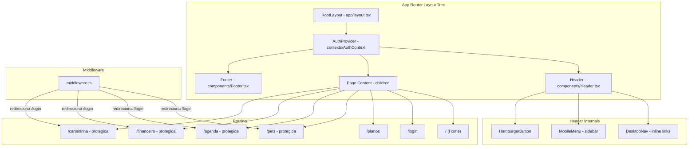

# Design Document — Layout Base

## Overview

O layout base do portal Pet Care fornece a estrutura de navegação fundamental: Header com logo e menus condicionais ao estado de autenticação, Footer com informações de contato, menu mobile com sidebar, e um sistema de rotas protegidas. A implementação segue a arquitetura do Next.js App Router com Server Components por padrão, Client Components apenas onde necessário (interatividade), Tailwind CSS para estilização mobile-first, e um AuthContext para gerenciar estado de autenticação.

### Decisões de Design

| Decisão | Escolha | Justificativa |
|---------|---------|---------------|
| Padrão de layout | Root Layout (`app/layout.tsx`) | Aproveitamos o layout nativo do App Router para envolver todas as rotas automaticamente |
| Gerência de autenticação | React Context (`AuthContext`) | Simples, sem dependência externa, adequado para mock/desenvolvimento inicial |
| Menu mobile | Client Component com estado local | Requer interatividade (abrir/fechar), isolado para não contaminar Server Components |
| Footer | Server Component | Sem interatividade — renderiza HTML estático no servidor |
| Proteção de rotas | Middleware do Next.js | Redireciona antes da renderização, sem flash de conteúdo não autorizado |
| Estilização | Tailwind CSS v4 com @theme inline | Já configurado no projeto com variáveis CSS customizadas |

## Architecture



### Fluxo de Renderização

1. `RootLayout` define `<html>` e `<body>` com a fonte Inter e classes flex
2. `AuthProvider` envolve os filhos fornecendo `isAuthenticated`, `user`, `login()`, `logout()`, `loading`
3. `Header` (Client Component) lê `AuthContext` e renderiza navegação condicional
4. `children` é o conteúdo da rota atual
5. `Footer` (Server Component) renderiza conteúdo estático

### Proteção de Rotas

O `middleware.ts` na raiz do projeto intercepta requisições para rotas protegidas (`/pets`, `/agenda`, `/financeiro`, `/carteirinha`). Verifica um cookie/token de autenticação e redireciona para `/login` se ausente.

## Components and Interfaces

### Árvore de Componentes

```
app/layout.tsx (RootLayout - Server Component)
├── contexts/AuthContext.tsx (AuthProvider - Client Component)
│   ├── components/Header.tsx (Client Component)
│   │   ├── components/MobileMenu.tsx (Client Component)
│   │   └── Navegação inline (desktop)
│   ├── {children} (Page content)
│   └── components/Footer.tsx (Server Component)
```

### Header (`components/Header.tsx`)

```typescript
"use client";

interface HeaderProps {}

// Lê AuthContext para determinar qual menu exibir
// Gerencia estado do MobileMenu (aberto/fechado)
export default function Header(): JSX.Element;
```

**Responsabilidades:**
- Renderizar logo "Pet Care" à esquerda
- Mostrar Menu_Público quando `isAuthenticated === false` ou `loading === true`
- Mostrar Menu_Autenticado + botão Logout quando `isAuthenticated === true`
- Mostrar HamburgerButton em mobile (< 768px) e links inline em desktop (≥ 768px)
- Gerenciar abertura/fechamento do MobileMenu

### MobileMenu (`components/MobileMenu.tsx`)

```typescript
"use client";

interface MobileMenuProps {
  isOpen: boolean;
  onClose: () => void;
  isAuthenticated: boolean;
  onLogout: () => void;
}

export default function MobileMenu(props: MobileMenuProps): JSX.Element | null;
```

**Responsabilidades:**
- Renderizar sidebar com transição slide-in da esquerda (duration-300)
- Renderizar backdrop semi-transparente
- Fechar ao clicar em link, backdrop ou pressionar Escape
- Retornar foco ao HamburgerButton ao fechar via Escape
- Aplicar `aria-modal`, `role="dialog"`, focus trap

### Footer (`components/Footer.tsx`)

```typescript
// Server Component — sem "use client"

interface FooterProps {}

export default function Footer(): JSX.Element;
```

**Responsabilidades:**
- Exibir informações de contato (email, telefone, endereço)
- Exibir links de navegação auxiliar (mínimo 3)
- Layout responsivo: coluna única em mobile, 3 colunas em desktop

### AuthContext (`contexts/AuthContext.tsx`)

```typescript
"use client";

interface User {
  name: string;
  email: string;
}

interface AuthContextType {
  isAuthenticated: boolean;
  user: User | null;
  loading: boolean;
  login: (email: string, password: string) => Promise<void>;
  logout: () => void;
}

export const AuthContext: React.Context<AuthContextType>;
export function AuthProvider({ children }: { children: React.ReactNode }): JSX.Element;
export function useAuth(): AuthContextType;
```

**Responsabilidades:**
- Fornecer estado de autenticação para toda a aplicação
- Expor funções `login()` e `logout()`
- Gerenciar estado `loading` durante verificação inicial
- Persistir estado via cookie (para que o middleware consiga ler)

### Middleware (`middleware.ts`)

```typescript
import { NextResponse } from "next/server";
import type { NextRequest } from "next/server";

export function middleware(request: NextRequest): NextResponse;
export const config: { matcher: string[] };
```

**Responsabilidades:**
- Verificar cookie de autenticação em rotas protegidas
- Redirecionar para `/login` se não autenticado
- Matcher: `["/pets", "/agenda", "/financeiro", "/carteirinha"]`

## Data Models

### AuthState

```typescript
interface AuthState {
  isAuthenticated: boolean;
  user: User | null;
  loading: boolean;
}
```

### User

```typescript
interface User {
  name: string;
  email: string;
}
```

### NavigationItem

```typescript
interface NavigationItem {
  label: string;
  href: string;
  isButton?: boolean; // true para Login (estilo botão)
}
```

### Constantes de Navegação

```typescript
const PUBLIC_NAV: NavigationItem[] = [
  { label: "Home", href: "/" },
  { label: "Planos", href: "/planos" },
  { label: "Login", href: "/login", isButton: true },
];

const AUTH_NAV: NavigationItem[] = [
  { label: "Meus Pets", href: "/pets" },
  { label: "Agenda", href: "/agenda" },
  { label: "Financeiro", href: "/financeiro" },
  { label: "Carteirinha", href: "/carteirinha" },
];

const PROTECTED_ROUTES = ["/pets", "/agenda", "/financeiro", "/carteirinha"];
```

### FooterData

```typescript
interface ContactInfo {
  email: string;
  phone: string;
  address: string;
}

interface FooterLink {
  label: string;
  href: string;
}
```

## Correctness Properties

*A property is a characteristic or behavior that should hold true across all valid executions of a system — essentially, a formal statement about what the system should do. Properties serve as the bridge between human-readable specifications and machine-verifiable correctness guarantees.*

### Property 1: Protected routes redirect unauthenticated users

*For any* route in the set of protected routes (`/pets`, `/agenda`, `/financeiro`, `/carteirinha`) and an unauthenticated user (no valid auth cookie), the middleware SHALL redirect the request to `/login` and prevent rendering of the protected page content.

**Validates: Requirements 7.9**

### Property 2: Public routes are accessible regardless of authentication state

*For any* route in the set of public routes (`/`, `/login`, `/planos`) and *for any* authentication state (authenticated or unauthenticated), the system SHALL render the page content without redirecting the user.

**Validates: Requirements 7.11**

### Property 3: Navigation items rendered match authentication state

*For any* authentication state, the Header navigation SHALL render exactly the items corresponding to that state — PUBLIC_NAV items when `isAuthenticated === false`, and AUTH_NAV items when `isAuthenticated === true` — with zero overlap between the two sets in the rendered DOM.

**Validates: Requirements 3.1, 3.3, 4.1, 4.4**

## Error Handling

### Cenários de Erro

| Cenário | Comportamento | Componente |
|---------|---------------|------------|
| Rota não encontrada (404) | Renderiza página `not-found.tsx` com mensagem de conteúdo não encontrado | App Router |
| AuthContext não disponível | Hook `useAuth()` lança erro com mensagem descritiva | AuthContext |
| Falha no logout | Captura erro, mantém estado anterior, exibe feedback | Header |
| Transição de estado durante loading | Exibe Menu_Público até resolução do estado | Header |
| MobileMenu aberto durante navegação | Fecha automaticamente ao navegar | MobileMenu |

### Estratégias

1. **Error Boundary**: Não aplicável neste escopo — erros de layout são capturados pelo `error.tsx` do App Router
2. **Graceful Degradation**: Se AuthContext falhar ao inicializar, o sistema trata como não autenticado (exibe menu público)
3. **Focus Management**: MobileMenu retorna foco ao trigger ao fechar, evitando perda de contexto para usuários de teclado

## Testing Strategy

### Abordagem de Testes

Este feature é primariamente de UI/layout com lógica condicional simples. A estratégia combina:

- **Unit tests (exemplo-based)**: Verificam renderização, presença de elementos, classes CSS, e interações
- **Property tests**: Verificam propriedades universais da lógica de roteamento e navegação condicional
- **Accessibility tests**: Verificam conformidade WCAG (contraste, ARIA, foco)

### Biblioteca de Property-Based Testing

- **fast-check** para TypeScript/JavaScript
- Mínimo 100 iterações por teste de propriedade
- Tag format: **Feature: layout-base, Property {number}: {property_text}**

### Suíte de Testes

#### Unit Tests (Example-Based)

| Teste | Componente | Validação |
|-------|-----------|-----------|
| Renderiza Header com logo "Pet Care" | Header | Req 2.1 |
| Logo tem classes text-xl font-bold | Header | Req 2.1 |
| Header tem bg-primary e text-white | Header | Req 2.2 |
| Header é sticky com z-10+ | Header | Req 2.3 |
| Menu público exibe 3 links quando não autenticado | Header | Req 3.1 |
| Login estilizado como botão (bg-white text-primary) | Header | Req 3.2 |
| Menu autenticado oculto quando não autenticado | Header | Req 3.3 |
| Loading state mostra menu público | Header | Req 3.4 |
| Menu autenticado exibe 4 links quando autenticado | Header | Req 4.1 |
| Botão Logout presente quando autenticado | Header | Req 4.2 |
| Clique em Logout chama logout() e redireciona | Header | Req 4.3 |
| Hamburger visível em mobile, oculto em desktop | Header | Req 5.1, 5.2 |
| MobileMenu abre com transição ao clicar hamburger | MobileMenu | Req 5.3 |
| MobileMenu fecha ao clicar em link | MobileMenu | Req 5.4 |
| MobileMenu fecha ao clicar backdrop | MobileMenu | Req 5.5 |
| MobileMenu fecha com Escape e retorna foco | MobileMenu | Req 5.6 |
| Footer exibe email, telefone, endereço | Footer | Req 6.1 |
| Footer tem mínimo 3 links | Footer | Req 6.2 |
| Footer responsivo (coluna mobile, grid desktop) | Footer | Req 6.5 |
| Cada rota renderiza heading correto | Pages | Req 7.1–7.7 |
| Rota indefinida mostra 404 | not-found | Req 7.10 |
| Hamburger tem área de toque 44x44px | Header | Req 8.2 |
| Hover em elementos interativos aplica primary-dark | Header/Footer | Req 9.3 |

#### Property Tests

| Property | Descrição | Iterações |
|----------|-----------|-----------|
| Property 1 | Rotas protegidas redirecionam não autenticados | 100 |
| Property 2 | Rotas públicas acessíveis em qualquer estado de auth | 100 |
| Property 3 | Itens de navegação correspondem ao estado de auth | 100 |

#### Smoke Tests

| Teste | Validação |
|-------|-----------|
| Footer é Server Component (sem "use client") | Req 6.4 |
| Fonte Inter carregada | Req 9.6 |
| Contraste #FFFFFF/#0D7377 ≥ 4.5:1 | Req 9.7 |
| Contraste #1F2937/#FFFFFF ≥ 4.5:1 | Req 9.7 |

### Ferramentas

- **Testing Library**: `@testing-library/react` + `@testing-library/jest-dom`
- **Test Runner**: Vitest (compatível com Next.js)
- **Property Testing**: fast-check
- **Mocks**: Mock do AuthContext via wrapper customizado para testes

