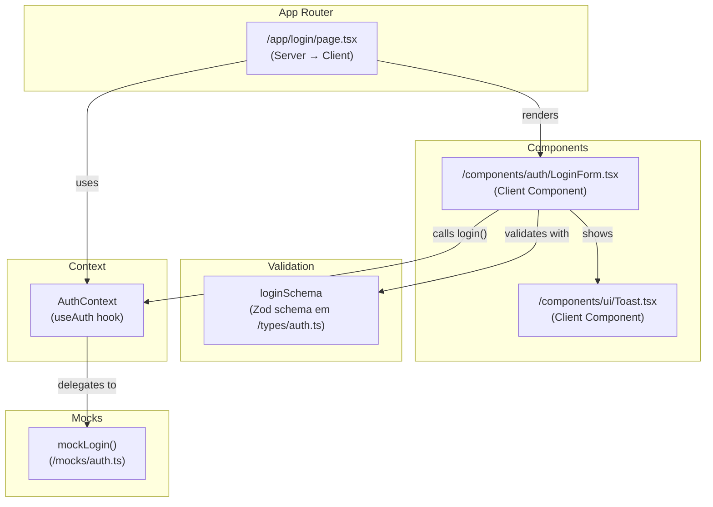
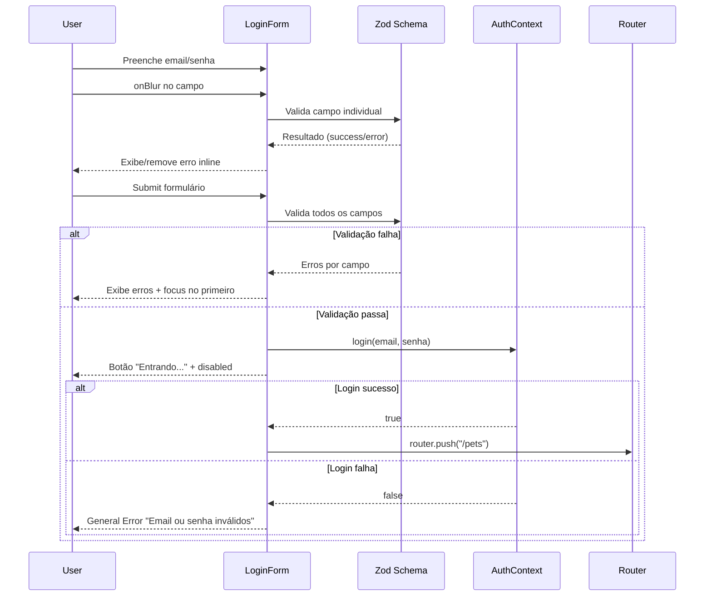

# Design Document: Login Page Zod Validation

## Overview

Este design descreve a implementação de um formulário de login com validação client-side usando Zod para o sistema Pet Care. A página de login (`/app/login/page.tsx`) será aprimorada com um componente `LoginForm` que valida email e senha em tempo real (onBlur), exibe erros inline acessíveis, gerencia estados de loading/submissão, e integra com o `AuthContext` existente para autenticação via mock.

### Decisões de Design Principais

1. **Componente separado `LoginForm`**: O formulário vive em `/components/auth/LoginForm.tsx` como client component, mantendo a página como orquestradora de redirecionamento e loading.
2. **Zod como engine de validação**: Usa `z.object()` para definir o schema e `safeParse()` / `parseAsync()` para validar campos individualmente (onBlur) e o formulário completo (onSubmit).
3. **Estado local com `useState`**: Sem bibliotecas de form management externas (react-hook-form não está no projeto). O estado de campos, erros e loading é gerenciado com hooks nativos do React.
4. **Toast simples via estado local**: O link "Esqueci minha senha" dispara um toast temporário sem dependência de biblioteca de toasts externa.

## Architecture



### Fluxo de Dados



## Components and Interfaces

### 1. LoginPage (`/app/login/page.tsx`)

Responsável por:
- Verificar estado de autenticação via `useAuth()`
- Redirecionar usuários autenticados para `/pets`
- Exibir loading spinner enquanto `isLoading === true`
- Renderizar `LoginForm` quando não autenticado

```typescript
// Sem props — é uma page component
// Usa useAuth() para isAuthenticated, isLoading
// Usa useRouter() para redirecionamento
```

### 2. LoginForm (`/components/auth/LoginForm.tsx`)

Componente client-side que encapsula toda a lógica do formulário.

```typescript
interface LoginFormState {
  email: string;
  senha: string;
  errors: {
    email?: string;
    senha?: string;
  };
  generalError: string | null;
  isSubmitting: boolean;
  showToast: boolean;
}
```

Responsabilidades:
- Gerenciar estado dos campos (email, senha)
- Validar campos onBlur com Zod
- Validar formulário completo no submit
- Chamar `login()` do AuthContext
- Gerenciar estados de loading e erro
- Mover focus para primeiro campo com erro
- Exibir toast "Funcionalidade em breve"

### 3. Toast (`/components/ui/Toast.tsx`)

Componente simples de notificação temporária.

```typescript
interface ToastProps {
  message: string;
  visible: boolean;
  onClose: () => void;
}
```

### 4. loginSchema (em `/types/auth.ts`)

```typescript
import { z } from "zod";

export const loginSchema = z.object({
  email: z
    .string()
    .min(1, { message: "Email inválido" })
    .max(254)
    .email({ message: "Email inválido" }),
  senha: z
    .string()
    .min(6, { message: "Senha deve ter no mínimo 6 caracteres" })
    .max(128),
});

export type LoginFormData = z.infer<typeof loginSchema>;
```

## Data Models

### Types Existentes (sem alteração)

```typescript
// /types/auth.ts — já existem
export interface User {
  nome: string;
  email: string;
}

export interface AuthContextType {
  user: User | null;
  isAuthenticated: boolean;
  isLoading: boolean;
  login: (email: string, senha: string) => Promise<boolean>;
  logout: () => void;
}
```

### Types Adicionados

```typescript
// /types/auth.ts — adicionados
import { z } from "zod";

export const loginSchema = z.object({
  email: z
    .string()
    .min(1, { message: "Email inválido" })
    .max(254)
    .email({ message: "Email inválido" }),
  senha: z
    .string()
    .min(6, { message: "Senha deve ter no mínimo 6 caracteres" })
    .max(128),
});

export type LoginFormData = z.infer<typeof loginSchema>;
```

### Estado do Formulário (interno ao componente)

| Campo | Tipo | Default | Descrição |
|-------|------|---------|-----------|
| email | `string` | `""` | Valor do campo email |
| senha | `string` | `""` | Valor do campo senha |
| errors.email | `string \| undefined` | `undefined` | Mensagem de erro do email |
| errors.senha | `string \| undefined` | `undefined` | Mensagem de erro da senha |
| generalError | `string \| null` | `null` | Erro geral de autenticação |
| isSubmitting | `boolean` | `false` | Se está aguardando resposta do login |
| showToast | `boolean` | `false` | Se o toast está visível |


## Correctness Properties

*A property is a characteristic or behavior that should hold true across all valid executions of a system — essentially, a formal statement about what the system should do. Properties serve as the bridge between human-readable specifications and machine-verifiable correctness guarantees.*

### Property 1: Email validation correctness

*For any* string input, the loginSchema SHALL accept it if and only if it is a non-empty string with a maximum length of 254 characters that matches a valid email format; otherwise it SHALL reject it producing the error message "Email inválido".

**Validates: Requirements 1.1**

### Property 2: Senha validation correctness

*For any* string input, the loginSchema SHALL accept it if and only if it has a length between 6 and 128 characters (inclusive); for strings with fewer than 6 characters, it SHALL produce the error message "Senha deve ter no mínimo 6 caracteres".

**Validates: Requirements 1.2**

### Property 3: Form values preserved on login failure

*For any* valid email and senha pair that passes client-side validation, if Auth_Context.login returns false, the LoginForm SHALL retain the exact same email and senha values in the input fields without modification.

**Validates: Requirements 2.7**

## Error Handling

### Validation Errors (Client-Side)

| Cenário | Comportamento | Mensagem |
|---------|--------------|----------|
| Email vazio | Rejeita no submit e onBlur | "Email inválido" |
| Email formato inválido | Rejeita no submit e onBlur | "Email inválido" |
| Email > 254 caracteres | Rejeita no submit e onBlur | "Email inválido" |
| Senha < 6 caracteres | Rejeita no submit e onBlur | "Senha deve ter no mínimo 6 caracteres" |
| Senha vazia | Rejeita no submit e onBlur | "Senha deve ter no mínimo 6 caracteres" |

### Authentication Errors

| Cenário | Comportamento | Mensagem |
|---------|--------------|----------|
| Credenciais inválidas | Exibe General_Error | "Email ou senha inválidos" |
| Erro inesperado no login | Exibe General_Error | "Email ou senha inválidos" |

### Estado de Erro e Recuperação

- Erros de validação inline são removidos automaticamente ao corrigir o campo e disparar onBlur
- General_Error é limpo automaticamente ao iniciar nova tentativa de submit
- Valores dos campos são preservados em caso de falha de autenticação
- O botão de submit volta ao estado normal ("Entrar") após falha

### Estratégia de Focus Management

1. No submit com erros de validação: focus move para o primeiro campo com erro (ordem DOM)
2. `aria-invalid="true"` é setado em todos os campos com erro
3. `aria-describedby` associa o campo ao elemento de erro correspondente

## Testing Strategy

### Abordagem de Testes

O projeto usa **Vitest** + **@testing-library/react** + **fast-check** (já configurados no `package.json`).

A estratégia combina:
- **Property-based tests** para validação do schema Zod (lógica pura com grande espaço de inputs)
- **Unit/integration tests** para comportamento do componente (interações UI, estados, acessibilidade)

### Property-Based Tests (fast-check)

Cada propriedade do design será implementada como um teste com **mínimo 100 iterações**.

| Propriedade | Arquivo de Teste | O que valida |
|-------------|-----------------|--------------|
| Property 1: Email validation | `__tests__/types/loginSchema.property.test.ts` | Schema Zod aceita/rejeita emails corretamente |
| Property 2: Senha validation | `__tests__/types/loginSchema.property.test.ts` | Schema Zod aceita/rejeita senhas por tamanho |
| Property 3: Form preservation | `__tests__/components/LoginForm.property.test.tsx` | Valores preservados após falha de login |

Formato de tag nos testes:
```typescript
// Feature: login-page-zod-validation, Property 1: Email validation correctness
// Feature: login-page-zod-validation, Property 2: Senha validation correctness
// Feature: login-page-zod-validation, Property 3: Form values preserved on login failure
```

Configuração: cada `it.prop` ou equivalente com `{ numRuns: 100 }` mínimo.

### Example-Based Unit Tests

| Componente | Arquivo de Teste | Cenários |
|------------|-----------------|----------|
| LoginForm | `__tests__/components/LoginForm.test.tsx` | onBlur validation, submit com erros, submit com sucesso, loading state, general error, toast, aria attributes |
| LoginPage | `__tests__/app/LoginPage.test.tsx` | Redirect quando autenticado, loading spinner, renderização do form |

### Cobertura de Acessibilidade

- Labels associadas via `htmlFor`/`id`
- `aria-describedby` em campos com erro
- `aria-invalid="true"` em campos com erro
- `aria-busy="true"` no botão durante loading
- `role="status"` no spinner de loading
- Focus management no submit com erros
- Input types corretos (`email`, `password`)

### Estrutura de Arquivos de Teste

```
__tests__/
├── types/
│   └── loginSchema.property.test.ts    ← Property tests (Properties 1, 2)
├── components/
│   └── LoginForm.property.test.tsx     ← Property test (Property 3)
│   └── LoginForm.test.tsx              ← Unit/integration tests
└── app/
    └── LoginPage.test.tsx              ← Page-level tests
```
